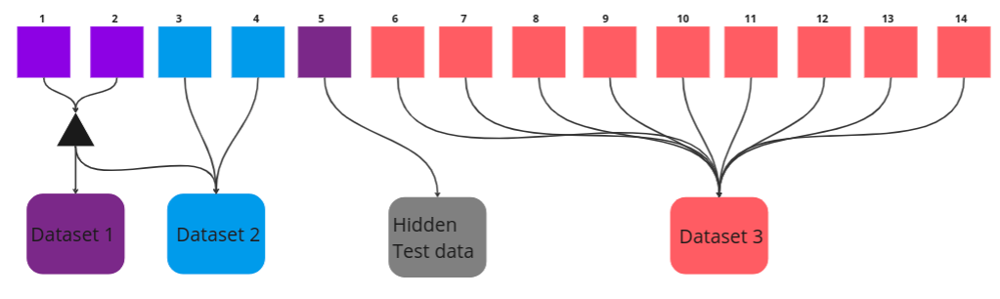
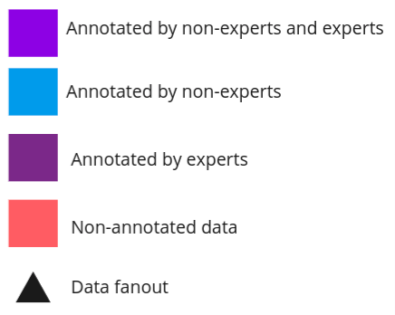
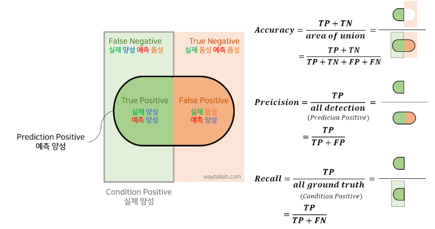
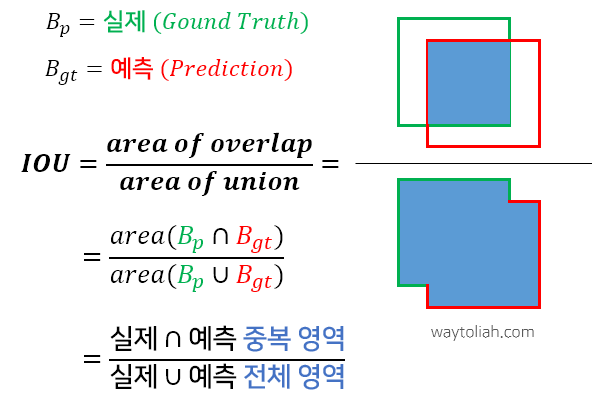

## KAGGLE Hubmap Segmentation COMPETITION

- 2D PAS-stained histology images from healthy human kidney tissue slides.
- result : 62 / 1021 Bronze Medal
- [Competition link](https://www.kaggle.com/competitions/hubmap-hacking-the-human-vasculature/overview)
- [PPT resource](https://www.canva.com/design/DAFuN-E-7Kc/j9mfJXZs2yCxPfbF_PfAGg/edit?utm_content=DAFuN-E-7Kc&utm_campaign=designshare&utm_medium=link2&utm_source=sharebutton)

 

----

 

# 대회 설명

- [목적] 사람의 신장 조직 2D PAD-stained histology slide image를 분석하여 모세혈관, 세동맥, 세정맥을 포함한 미세혈관 구조의 사례를 분할(segmentation)

 

---

 

### DATASET

 

- **dataset info**
  - train: 
    - 3개의 dataset으로 구성되어 있으며, dataset 1은 전문가의 검토를 거친 정답으로 구성한 데이터(wsi 1,2)
    - dataset 2는 전문가의 검토가 없이 정답을 구성한 데이터(wsi 3,4)
    - dataset 3는 정답이 없는 non-labeled 데이터(wsi 6,7,8,9,10,11,12,13,14)
    - *모든 test set은 dataset 1로 구성*

  - label : tile image에서 찾고자 하는 미세혈관의 mask image, 
    - blood_vessel, glomerulus, unsure로 annotation되어 있고, blood_vessel을 분할하는 것이 목표

- 각 wsi의 크기는 가로 세로 10000pixel이 넘어가는 매우 큰 image
- dataset은 wsi 하나의 image를 제공하는 것이 아니라 하나의 wsi image를 512x512pixel 사이즈로 tile화하여 제공

 

 | 
|--|--|

  

-----

 

### 평가지표

 

- Segmentation is calculated using IoU with a threshold of 0.6
- **임계 0.6을 기준으로 Iou score**

 |  
---|---|

 

--- 

 

### Model

 

- segmentation에서 가장 많이 사용하는 unet을 baseline으로 설정
- Unet, Unet ++, mmdetection(mask-rcnn-50, 101)
- 가벼운 모델부터 시작하여 실험을 통해 다른 모델들로 확장
  - 빠른 학습, 빠른 실험, 오버피팅 위험 회피 

 

- input shape : [BATCH, CHAN, WIDTH, HEIGHT] 
- output shape : [BATCH, 1, WIDTH, HEIGHT] # IMAGE MASK

 

---

 

### 전처리

 

- 전문가의 평가가 있는 dataset 1을 집중적으로 train하는 전략
    - tile image를 하나의 whole image로 구성한 후, mask가 포함되어 있는 image만 filtering
    - stride를 추가하여 더 많은 데이터 셋을 구성
    - wsi source에 따라 kfold 적용하여 dataset을 나눔
    - mmdetection mask rcnn 모델은 coco dataset 형태를 사용하기 떄문에 coco dataset을 생성하여 추가로 저장

 

---

 

### Result

- 가장 높은 CV를 지닌 모델과 가장 높은 LB value를 지닌 모델을 제출
- dilate를 적용한 imference를 제출

- **public score: 0.392, 551 place / private score: 0.442, 62 place**

 

---

 

### 배운 점

 

1. object detection과 segmentation에 사용되는 mmdetection 라이브러리를 활용한 경험
   - mmdetection config가 python 스크립트로 이미 정해져 있어 augmentation이나 다른 설정들을 바꿔주기 위해 직접 script 파일에서 해당 부분을 찾아 수정
   - 버전에 따라 활용할 수 있는 augmentation이 달라서 버전을 여러 가지 활용함

 

2. COCO DATASET을 생성한 경험
    - DETECTION이나 SEGMENTATION TASK를 진행하다보면 BOX의 ANNOTATION의 형태가 다른 경우가 존재(COCO, PASCAL)
    - 이에 맞게 데이터를 전처리하여 저장하여 활용해야 하는데, 이 대회를 통해 coco dataset을 만드는 방법을 배움

 

3.  binary_dilation의 사용여부
    - 예측결과에 post processing의 일환으로 binary dilation을 사용하는 것과 하지 않는 것이 대회에서 주요 질문이 됨
    - binary dilation이란 예측된 마스크에서 pixel을 확장시키는 방법, 이를 활용하면 edge부분을 커버할 수 있음,  전 대회들에서 확장시킨 결과와 확장시키지 않은 결과 간의 큰 shake up이 발생하여 이에 대한 뜨거운 토론들이 발생

 

4. dataset 3에 대한 pseudo labeling의 여부
   - 전문가의 검토를 받은 dataset 1을 학습을 진행한 후, dataset 3을 예측하여 다시 이를 활용하는 방법
   - dataset 3이 가장 많은 데이터양을 가진 만큼 이를 활용한다면 더 좋은 성능을 낼 수 있다고 생각함
   - 결과적으로 상위 notebook에서 2 stage train 계획을 세워 진행했을 때 더 좋은 일반화 성능을 보임

 

---

